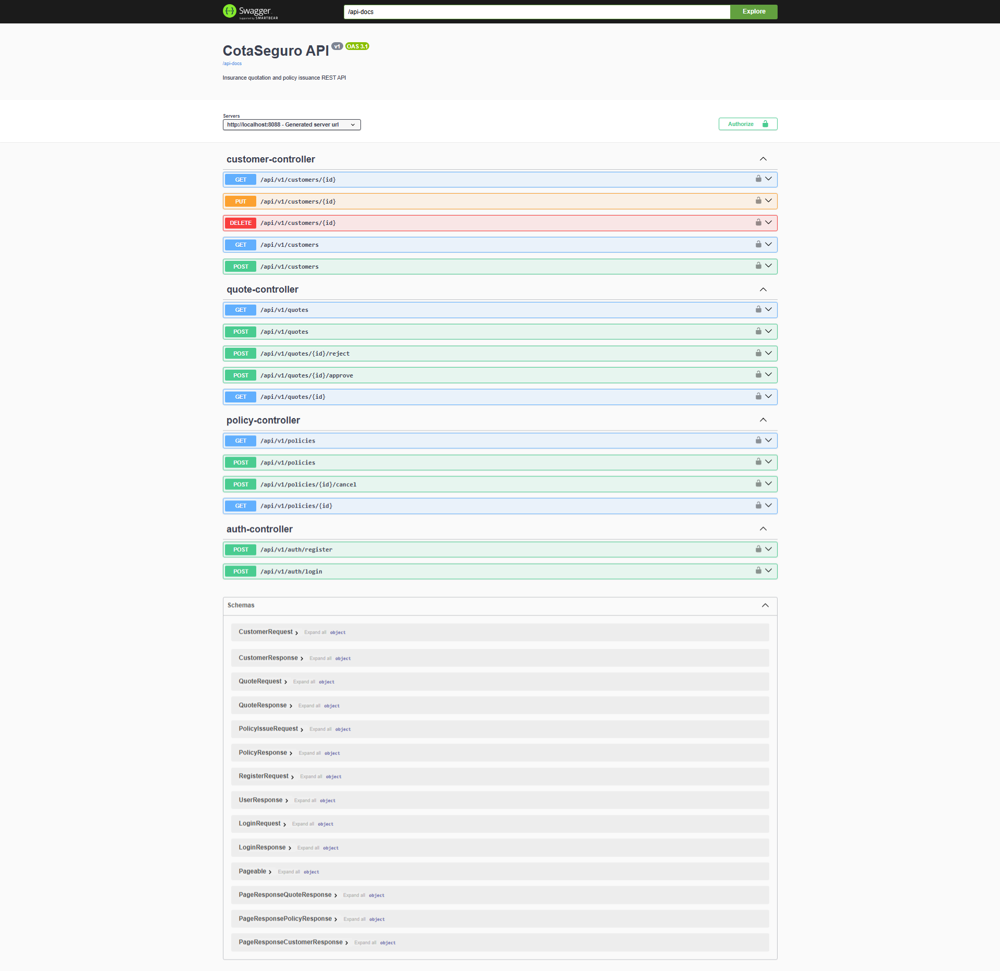

# CotaSeguro

[](https://github.com/joao-vitorb/cotaseguro/actions/workflows/ci.yml)


[](LICENSE)

CotaSeguro is a REST API for **insurance quotation and policy issuance**. It
registers customers, generates quotes from simple business rules (premium based
on insurance type, coverage amount and customer age), turns an approved quote
into a policy and tracks policies through their lifecycle.

It is a backend-focused portfolio project that demonstrates a clean, layered
architecture with Java and Spring Boot: JWT authentication with roles, relational
persistence with migrations, asynchronous processing, caching, rate limiting,
observability, automated tests (~94% coverage), CI/CD and containerized
deployment.

## Quickstart

### Option A — Docker (recommended, one command)

```bash
docker compose --profile app up -d --build
```

The API starts at `http://localhost:8088`, applies database migrations and seeds
a demo admin and sample customers automatically. Check it and open the docs:

```bash
curl http://localhost:8088/actuator/health      # {"status":"UP"}
```

Then browse the Swagger UI at `http://localhost:8088/swagger-ui`. Authenticate to
get a token (a demo admin is seeded):

```bash
curl -X POST http://localhost:8088/api/v1/auth/login \
  -H "Content-Type: application/json" \
  -d '{"username":"admin","password":"admin123"}'
```

```json
{ "token": "eyJhbGciOiJIUzI1NiJ9...", "tokenType": "Bearer", "username": "admin", "role": "ADMIN" }
```

### Option B — Local (JDK 21, no Maven install)

The project ships with the Maven Wrapper, so only Java 21 and Docker are needed.
Start the supporting services and run the app:

```bash
docker compose up -d            # PostgreSQL, RabbitMQ and Redis
./mvnw spring-boot:run          # Windows: .\mvnw.cmd spring-boot:run
```

The API runs with the `dev` profile at `http://localhost:8088`.

> The project uses dedicated host ports (PostgreSQL `5440`, RabbitMQ `5673`,
> Redis `6380`, API `8088`) to avoid clashing with services you may already run.

The sections below cover configuration, every endpoint and the full setup in detail.

## Screenshots

Interactive API documentation (Swagger UI) at `/swagger-ui`:



## Table of contents

- [Quickstart](#quickstart)
- [Screenshots](#screenshots)
- [Features](#features)
- [Tech stack](#tech-stack)
- [Architecture](#architecture)
- [Domain model](#domain-model)
- [Requirements](#requirements)
- [Configuration](#configuration)
- [Running](#running)
- [Authentication and roles](#authentication-and-roles)
- [Asynchronous policy issuance](#asynchronous-policy-issuance)
- [Caching and rate limiting](#caching-and-rate-limiting)
- [Observability](#observability)
- [Error format](#error-format)
- [API endpoints](#api-endpoints)
- [Testing](#testing)
- [Deployment](#deployment)
- [Project structure](#project-structure)

## Features

- JWT authentication with `ADMIN` and `USER` roles and BCrypt password hashing
- Customer CRUD with filtering and pagination
- Quote generation with a premium rule based on insurance type, coverage and age
- Quote approval and rejection with validated status transitions
- Asynchronous policy issuance from approved quotes via RabbitMQ
- Policy listing, lookup and cancellation
- Redis caching of customer lookups with eviction on writes
- Login rate limiting to mitigate brute-force attacks
- Standardized error responses and a global exception handler
- Structured JSON logging, request correlation and Prometheus metrics
- Swagger UI documentation and Actuator health checks

## Tech stack

- Java 21
- Spring Boot 3 (Spring Web)
- Spring Security + JWT (jjwt)
- Spring Data JPA + Hibernate
- PostgreSQL + Flyway (database migrations)
- RabbitMQ (Spring AMQP) for asynchronous issuance
- Redis (Spring Cache) for query caching
- Bean Validation
- Micrometer + Prometheus and structured (ECS) logging
- springdoc-openapi (Swagger UI)
- JUnit 5 + Mockito, JaCoCo (coverage)
- Maven (via Maven Wrapper), Docker and Docker Compose

## Architecture

The code is organized in clear layers, each with a single responsibility:

- **Controllers** (`controller`): HTTP handling and request/response shaping.
- **DTOs** (`dto`): validated request and response records; entities are never exposed.
- **Services** (`service`): business logic (premium calculation, status transitions, issuance).
- **Repositories** (`repository`): data access with Spring Data JPA.
- **Domain** (`domain`): JPA entities and enums.
- **Mappers** (`mapper`): conversion between entities and DTOs.
- **Security** (`security`): JWT filter, authentication, authorization and rate limiting.
- **Messaging** (`messaging`): RabbitMQ publisher and consumer for policy issuance.
- **Observability** (`observability`): metrics and request logging.
- **Exception** (`exception`): domain exceptions and the global handler.

## Domain model

- **Customer**: `name`, `document`, `birthDate`, `email`.
- **Quote**: belongs to a customer; `insuranceType`, `coverageAmount`, computed
  `premium`, `status` (`PENDING`, `APPROVED`, `REJECTED`).
- **Policy**: issued from an approved quote; `number`, `status` (`ACTIVE`,
  `CANCELLED`, `EXPIRED`), `startDate`, `endDate`.

The premium is `coverageAmount * typeRate * ageFactor`, where the rate depends on
the insurance type (`AUTO`, `LIFE`, `HOME`, `TRAVEL`) and the age factor depends
on the customer's age bracket.

## Requirements

- Java 21
- Docker (PostgreSQL, RabbitMQ and Redis run in containers)

Maven is not required: the Maven Wrapper downloads the right version automatically.

## Configuration

Configuration is split by Spring profile and every value has a safe default for
local development. The active profile defaults to `dev` and can be overridden
with `SPRING_PROFILES_ACTIVE`.

- `dev`: human-readable logs, detailed health output and a seeded admin and demo data.
- `prod`: structured JSON (ECS) logs and minimal health output.
- `test`: used by the test suite (in-memory cache, messaging and Redis disabled).

Settings can be overridden through environment variables:

| Variable | Default | Description |
|----------|---------|-------------|
| `SPRING_PROFILES_ACTIVE` | `dev` | Active Spring profile |
| `SERVER_PORT` | `8088` | HTTP port |
| `DB_URL` | `jdbc:postgresql://localhost:5440/cotaseguro` | JDBC URL |
| `DB_USERNAME` | `cotaseguro` | Database user |
| `DB_PASSWORD` | `cotaseguro` | Database password |
| `JWT_SECRET` | _(dev-only default)_ | HMAC secret (at least 32 bytes) |
| `JWT_EXPIRATION_MS` | `3600000` | Token lifetime in milliseconds |
| `RABBITMQ_HOST` | `localhost` | RabbitMQ host |
| `RABBITMQ_PORT` | `5673` | RabbitMQ port |
| `RABBITMQ_USERNAME` | `cotaseguro` | RabbitMQ user |
| `RABBITMQ_PASSWORD` | `cotaseguro` | RabbitMQ password |
| `REDIS_HOST` | `localhost` | Redis host |
| `REDIS_PORT` | `6380` | Redis port |
| `LOGIN_RATE_LIMIT_ENABLED` | `true` | Enable login rate limiting |
| `LOGIN_RATE_LIMIT_MAX_ATTEMPTS` | `5` | Allowed login attempts per window |
| `LOGIN_RATE_LIMIT_WINDOW_SECONDS` | `60` | Rate limit window in seconds |

In the `dev` profile an admin user is seeded if it does not exist (username
`admin`, password `admin123`), configurable through `app.admin.username` and
`app.admin.password`.

## Running

```bash
docker compose up -d
./mvnw spring-boot:run
```

Useful endpoints:

- Swagger UI: `http://localhost:8088/swagger-ui`
- OpenAPI document: `http://localhost:8088/api-docs`
- Health check: `http://localhost:8088/actuator/health`
- Metrics (Prometheus, authenticated): `http://localhost:8088/actuator/prometheus`
- RabbitMQ management UI: `http://localhost:15673` (user/password `cotaseguro`)

## Authentication and roles

The API is secured with JWT. Send credentials to `POST /api/v1/auth/login` to
receive a token, then send it on protected requests as
`Authorization: Bearer <token>`. In the Swagger UI, use the **Authorize** button.

Reads are available to any authenticated user; writes that change business state
(creating and editing customers, approving and rejecting quotes, issuing and
cancelling policies, registering users) require the `ADMIN` role. The login
endpoint is rate limited per client IP and returns `429 Too Many Requests` once
the limit is reached.

## Asynchronous policy issuance

Issuing a policy is asynchronous. `POST /api/v1/policies` validates the request
(the quote must exist, be approved and not already have a policy) and, when
valid, publishes a message to RabbitMQ and returns `202 Accepted`. A consumer
then creates the policy idempotently. Poll `GET /api/v1/policies` to see the
issued policy.

## Caching and rate limiting

Customer lookups by id (`GET /api/v1/customers/{id}`) are cached in Redis and the
cached entry is evicted when the customer is updated or deleted. The login
endpoint is rate limited in memory per client IP. In the test profile an
in-memory cache is used and rate limiting is disabled.

## Observability

- Every response carries an `X-Request-Id` header (generated or taken from the
  request), added to the logs through the MDC for correlation.
- Custom business metrics are exposed via Micrometer: `cotaseguro.quotes.generated`
  and `cotaseguro.policies.issued`.
- Health and info are public; metrics and Prometheus require authentication.
- In the `prod` profile logs are emitted as structured JSON (ECS format).

## Error format

Errors share a consistent JSON structure:

```json
{
  "timestamp": "2026-06-24T00:49:20.99",
  "status": 400,
  "error": "Bad Request",
  "message": "Validation failed",
  "path": "/api/v1/customers",
  "fieldErrors": [{ "field": "email", "message": "must be a well-formed email address" }]
}
```

Common status codes: `400` (validation), `401` (unauthenticated or invalid
credentials), `403` (forbidden), `404` (not found), `409` (conflict / invalid
status transition) and `429` (rate limit).

## API endpoints

All endpoints are versioned under `/api/v1`. Roles in brackets are required.

### Authentication

```
POST /api/v1/auth/login            # public
POST /api/v1/auth/register         # [ADMIN] creates a USER
```

### Customers

```
POST   /api/v1/customers           # [ADMIN]
GET    /api/v1/customers?name=&page=&size=
GET    /api/v1/customers/{id}      # cached
PUT    /api/v1/customers/{id}      # [ADMIN]
DELETE /api/v1/customers/{id}      # [ADMIN]
```

Create a customer:

```
POST /api/v1/customers
Authorization: Bearer <token>
Content-Type: application/json

{
  "name": "Alice Martins",
  "document": "11111111111",
  "birthDate": "1990-04-12",
  "email": "alice.martins@example.com"
}
```

### Quotes

```
POST /api/v1/quotes
GET  /api/v1/quotes?customerId=&status=&page=&size=
GET  /api/v1/quotes/{id}
POST /api/v1/quotes/{id}/approve   # [ADMIN]
POST /api/v1/quotes/{id}/reject    # [ADMIN]
```

Generate a quote (the premium is computed by the server):

```
POST /api/v1/quotes
Authorization: Bearer <token>
Content-Type: application/json

{ "customerId": 1, "insuranceType": "AUTO", "coverageAmount": 50000.00 }
```

```json
{
  "id": 1,
  "customerId": 1,
  "insuranceType": "AUTO",
  "coverageAmount": 50000.00,
  "premium": 2500.00,
  "status": "PENDING",
  "createdAt": "2026-06-24T00:17:42"
}
```

### Policies

```
POST /api/v1/policies              # [ADMIN] async, returns 202 Accepted
GET  /api/v1/policies?customerId=&status=&page=&size=
GET  /api/v1/policies/{id}
POST /api/v1/policies/{id}/cancel  # [ADMIN]
```

Request issuance for an approved quote:

```
POST /api/v1/policies
Authorization: Bearer <token>
Content-Type: application/json

{ "quoteId": 1 }
```

The `.http` files under `http/` contain ready-to-run request collections for the
customer, quote and policy flows.

## Testing

The tests run against a real PostgreSQL database (started with Docker Compose),
while messaging, caching and rate limiting are exercised without external
brokers. Coverage is measured with JaCoCo and the build fails below the
configured minimum.

```bash
docker compose up -d
./mvnw verify
```

The HTML coverage report is generated at `target/site/jacoco/index.html`.

## Deployment

A multi-stage `Dockerfile` builds a small runtime image that runs as a non-root
user. Build it with:

```bash
docker build -t cotaseguro:latest .
```

The whole stack (API plus PostgreSQL, RabbitMQ and Redis) can be started with the
`app` Compose profile:

```bash
docker compose --profile app up -d --build
```

After tests pass, the CI/CD pipeline builds and publishes the image to the GitHub
Container Registry on pushes to `main` and on `v*.*.*` tags:

```bash
docker pull ghcr.io/joao-vitorb/cotaseguro:latest
```

## Project structure

```
src/main/java/com/cotaseguro/
  CotaSeguroApplication.java   # application entry point
  config/                      # OpenAPI, cache and dev data seeding
  controller/                  # REST controllers (auth, customers, quotes, policies)
  service/                     # business logic and premium calculation
  repository/                  # Spring Data JPA repositories
  domain/                      # JPA entities and enums
  dto/                         # request/response records and the error payload
  mapper/                      # entity <-> DTO mappers
  security/                    # JWT, authorization, rate limiting
  messaging/                   # RabbitMQ publisher and consumer
  observability/               # metrics and request logging
  exception/                   # domain exceptions and global handler
src/main/resources/
  application.yml              # base configuration and profiles
  db/migration/                # Flyway schema migrations
  db/seed/                     # dev-only demo data
src/test/java/com/cotaseguro/  # unit and integration tests
http/                          # REST Client request collections
Dockerfile                     # production image (multi-stage)
docker-compose.yml             # app + PostgreSQL + RabbitMQ + Redis
.github/workflows/ci.yml       # CI/CD pipeline
```

## License

This project is licensed under the MIT License. See [LICENSE](LICENSE) for details.
